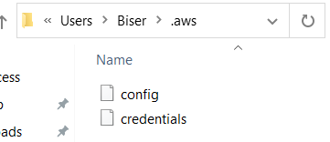

# Install on Windows

Click [here](https://docs.aws.amazon.com/cli/latest/userguide/install-cliv2-windows.html) or search for 'aws cli windows' to download the installer. Install the latest version.

Installation process is as simple as clicking multiple times next button. To check if installed correctly as suggested in the above link in the cmd type

```bash
aws --version
```

The expected result is something like _aws-cli/2.1.19 Python/3.7.9 Windows/10 exe/AMD64 prompt/off_

# Configuration

Because the aws cli is going to access our aws account of course we need to configure credentials.

1. You can get your credentials after login with you aws account on the aws website.
2. Click your account name (top-right on the screen) and from the drop down select **My security credentials**, then click **Create Access Key** and download it as csv file. Note if someone get your access keys, they can use your account, so keep them secret. Alternatively you can access My security credentials using the IAM service.
3. Now open the console (cmd) and type:

```bash
aws configure
```

or

```bash
aws configure --profile some-name
```

the second option is to give a specific name to the profile, otherwise it will be default.
You will be asked for access key and secret (get them from the csv file), the region for your account and leave the last option empty to default as json.

If you have done everything correctly in your the following folder _Users/your-username/.aws_ you should be able to see the new config files containing the info you provided.


Important info here is to use this credentials only on your computer, not to upload them to any aws service (EC2 for example), because people can steal them and impersonate you with actions you never did. The best and recommended way for authorizing is to use IAM role and attaching that role to instance of a service.

## AWS CloudShell

CloudShell is alternative to the local CLI installing and usage. For example we can open CloudShell in the management console and it will open as a console, where we can run the same commands like _aws --version_ etc.

CloudShell is not available in all regions, you can google the availability list or check if you have terminal icon left on your name (top-right) in the managment console.
