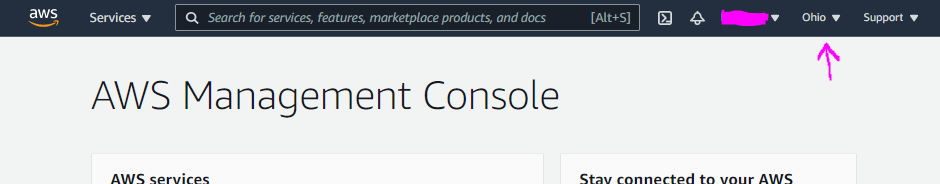

# AWS Regions

You can check the list with regions by click the already selected region top left on your screen.

Every service is living in specific region (except some). For example if you have already selected Ohio region and then for example Lambda service, you will see only lambdas you have in that region, not from other regions in case you also have.

And some services are global, for example IAM. If you select IAM service regions list will be greyed out and not selectable, because it is global service.

_Availability zones_ - every regions has multiple AZs (minimum 2). Basically they are data centers for 1 region, but working in isolation from one another in case of some kind of disaster.
