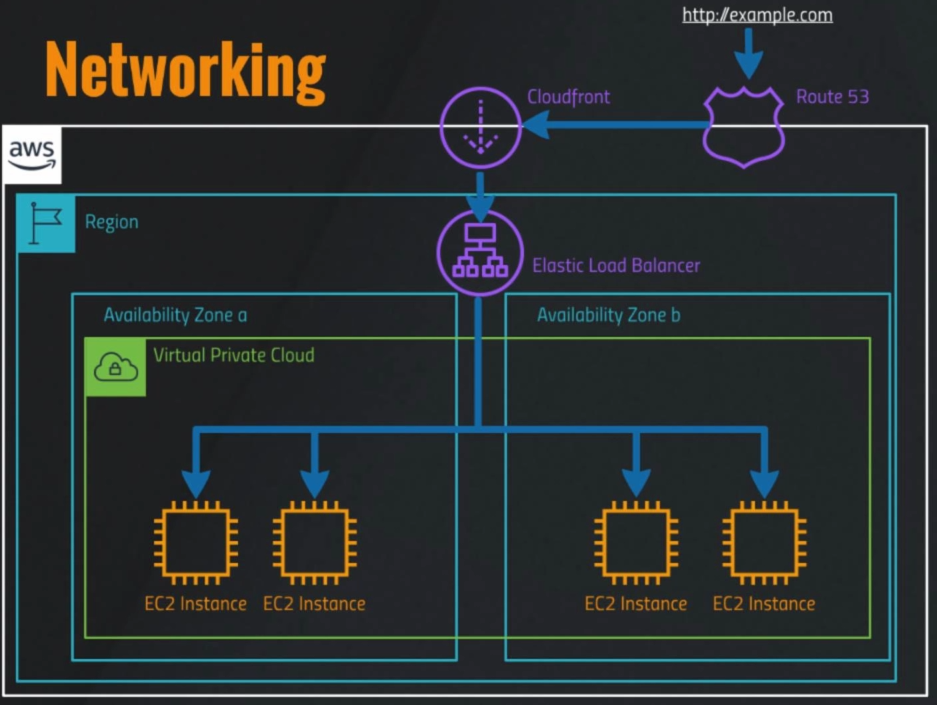
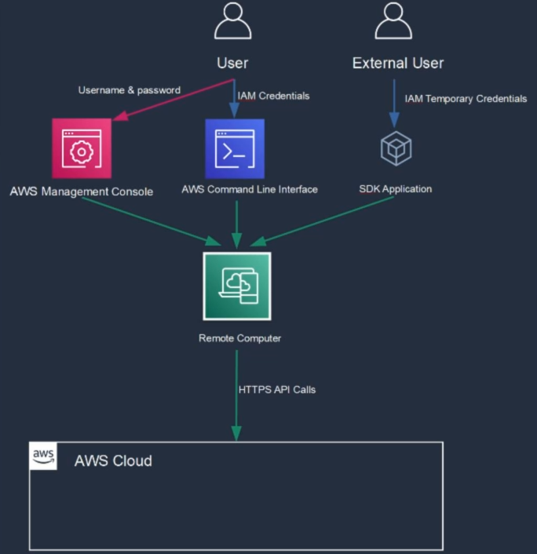

### Networking

### Authorization

1. External users are people (customers) using our application. We still need to give them temporary credentials (cognito, oauth2 etc..) to access the aws cloud.

