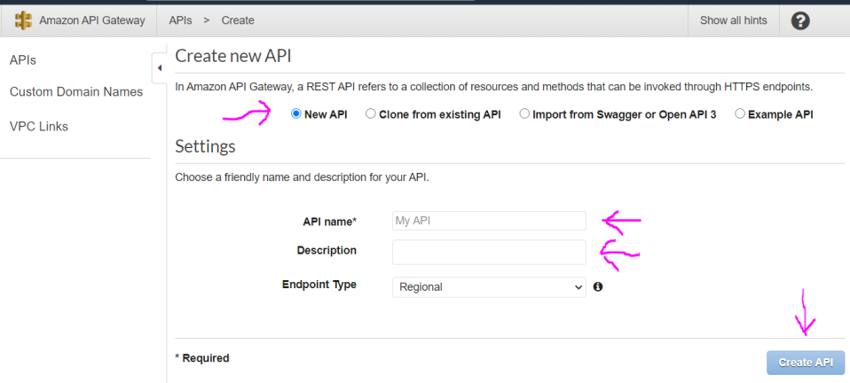
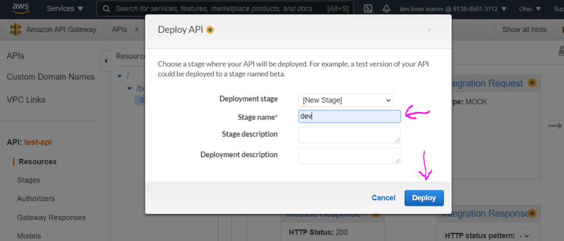
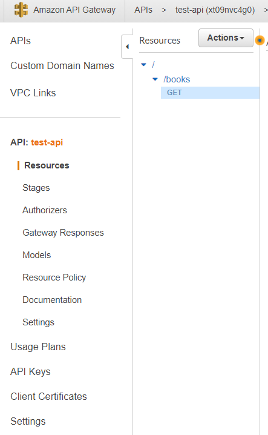

# API Gateway

The APIGateway service provide us a way for creating serverless API.

# Basic Usage

1. In the AWS managment console search for **APIGateway** service or pick from the Services dropdown menu.


2. Then click the button **Create API** to create new API (you can have multiple), if you don't alreayd have one go to the next step..

3. Select the type of an API you want to use, **REST API** in this case and click **Build** button

4. Keep the radio button selected as **New API**. And in the settings section provide some name for the API and some description. And click **Create API** button.



5. Click the **Actions** button and from dropdown menu select **Create Resource**. Resources are the parts of the url.

6. Name the resource and click **Create Resource**.


_Note_: **Configure as proxy resource** - means that this resource will also catch all other resources and methods. Some use case for catching everything would be if we are creating some kind of full stack application.

_Note_: **Enable API Gateway CORS** - the browser will check if our api/server allows to be accessed. By checking this box we will be also provided with resource with type OPTIONS, where in the Integration Response we can set our cors headers. By checking this box we will have some already predefined in the OPTIONS resource in the Integration response.

Now for the OPTIONS method in the Integration response we have these default headers, after we checked cors. Important note here is that cors headers will be added only for the OPTIONS method, but once we add the actual method we going to use (POST for example) we need to add the missing cors headers manually. Set the header key in the _Method Response_ and header value in _Integration Response_


7. Make sure you marked/selected the resource so you can give it a method type. Click again the **Actions** button and click **Create Method** for example GET method.

8. Click the small check button and you will be given the option to define some kind of controller. For example a Lambda Function. Click **Save** to finish the process. Of course if you don't have any Lambda function to use you will need to create one or if you do have type its name. Also confirm to give the APIGateway permission to use the lambda function.


_Note_: **Lambda Function** - we can run any type of code on demand, whenever this resource is reached.

_Note_: **HTTP** - with this option we can for example forward the request to another API.

_Note_: **Mock** - it is some kind of dummy endpoint which will do nothing, we could send some dummy data.

_Note_: **AWS Service** - with this option we can call another AWS service.

_Note_: **Use Lambda Proxy Integration** - if checked it will pass everything from the request as json to the lambda function. It will be now our responsibility to return meaningful response, otherwise we will get error.

9. Once saved you will see the following setup. By clicking the **TEST** icon you can test the result of the function. To be able to see this cycle view you need to have selected **Resources** from the menu on the left.


10. Click again the **Action** button and click **Deploy API**. From the popup window select Deployment Stage and give it a name and optionally description and click **Deploy**. Everytime we make changes on our API we have to deploy changes, otherwise they won't take effect.



11. And here you can see the generated route.


---

# Left side menu

Some details for the menu options on the left:



- **APIs** - this list of APIs we have.
- **Custom Domain Names** - we can select different domain name than what we had autogenerated, when creating the API.
- **VPC Links**
- **API: my-api**

  - **Resources** - resources are the paths in our url
  - **Stages** - stages are snapshots of our API. Everytime we deploy with the Actions button our API we create stage tracking our changes.
  - **Authorizers** - they allow us to create authentication for our API.
  - **Gateway Responses**
  - **Models** - here we create the shape of the data for our api, for example as json.
  - **Resource Policy**
  - **Documentation** - useful especially if we share our api with other developers.
  - **Dashboard**
  - **Settings**

- **Usage Plans**
- **API Keys** - by clicking the **Actions** button select **Create API Key**. Give it a name you want and optionally description. The API key can be auto generated or you have custom one then provide by checking the **Custom** button.
- **Client Certificates**
- **Settings** - here we manage the roles and permissions for our service, because by default each service in AWS has no permissions at all.

# Controller

Controlling of what happens, when our API is accessed is defined with working on the request and the response. In this example the cycle of the image below will start when we receive POST request for something/compare-yourself url:


1. **Method Request** - here we can validate the request, like authorization, api keys required.

2. **Integration Request** - if everything was validated and correct in the previous we get to this step. Here we can transform the incoming data in the shape we want it.

3. **Integration Response** - in the integration request we shape the data we receive and here we shape the data we are going to send.

4. **Method Response** - here we can set response status code and the type of headers. Only the type of the headers, the value still will be in integration response.

Below is an example of how to transform the response in a easy to use way for a lambda function.

```javascript
// this is how the code in lambda function looks like
exports.handler = async (event) => {
  const age = event.myAge;
  return age;
};
```

1. Click the **Integration Request** and expand the **Mapping Templates** section. Check the (recommended) second option. Click the **Add mapping template** link and provide type _application/json_, provide some template and click the **Save** button.


$input refers to the request data and the dollar sign refers to the request body. Read [here](https://docs.aws.amazon.com/apigateway/latest/developerguide/api-gateway-mapping-template-reference.html) for more info on mapping templates syntax.

2. Go back to the Method Execution (req-res cycle diagram) and click the **Test** icon. For the **Request Body** provide the following object:

```javascript
// testing body data
{
  "personData": {
    "age": 28
  }
}
```

3. In the **Response Body** you should see 28. This way we have clear separation, where APIGateway is extracting the data and providing to the Lambda function only the data it needs.
