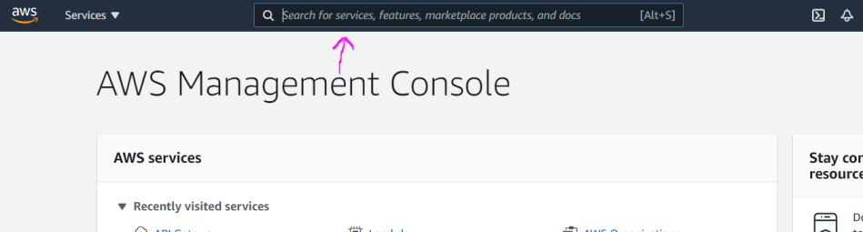

# API Gateway

The API service provide us a way for creating serverless API.

# Usage

1. In the AWS managment console search for **APIGateway** service or from the Services dropdown menu.

2. Then click the button **Create API** to create new API (you can have multiple).

3. Select the type of an API you want to use, **REST API** in this case and click **Build** button

4. Keep the radio button selected as **New API**. And in the settings section provide some name for the API and some description. And click **Create API** button.

5. Click the **Actions** button and from dropdown menu select **Create Resource**. Resources are the parts of the url.

6. Name the resource and click **Create Resource**.

7. Make sure you marked/selected the resource so you can give it a method type. Click again the **Actions** button and click **Create Method** for example GET method.

8. Click the small check button and you will be given the option to define some kind of controller. For example a Lambda Function. Click **Save** to finish the process.

9. Once saved you will see the following setup

10. Click again the **Action** button and click **Deploy API**. From the popup window select Deployment Stage and give it a name and optionally description and click **Deploy**.

11. And here you can see the generated route.

