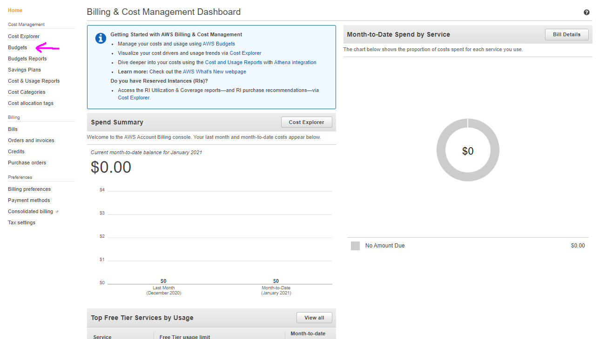
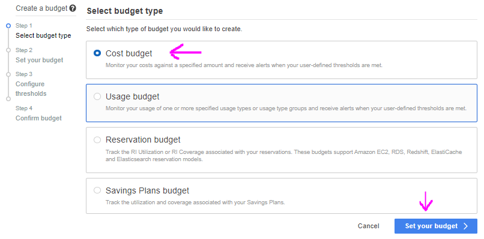
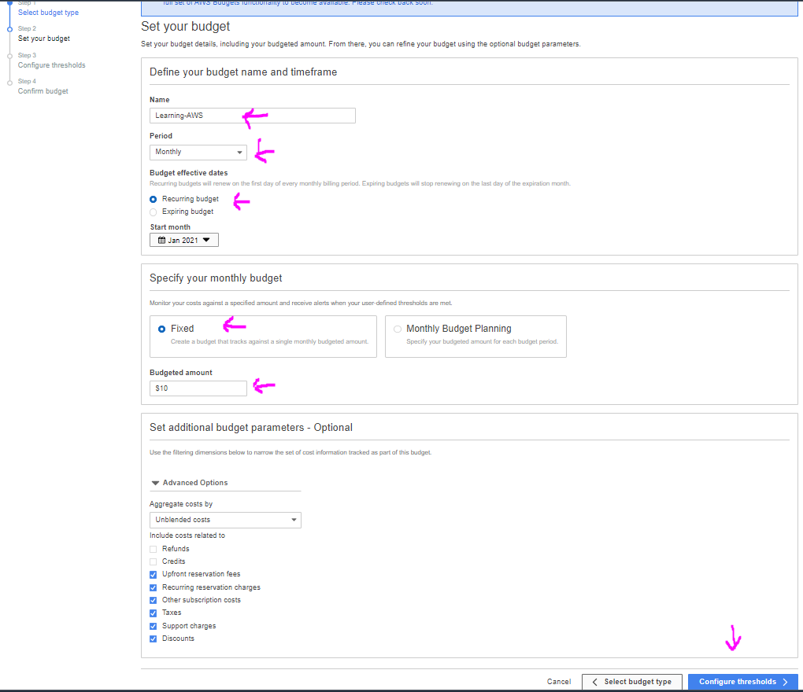
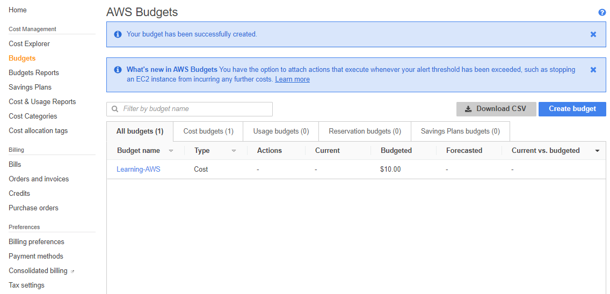
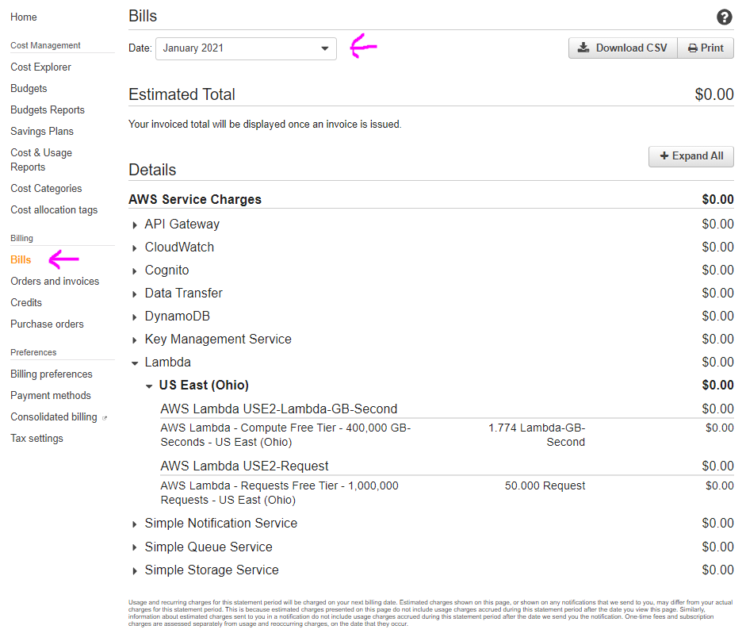

# Billing

Service which gives us control over all billing related stuff.

# Basic Usage

1. In the AWS managment console search for **Billing** service or pick from the Services dropdown menu.
   

# Setup a budget

With this feature you can setup a budget and once you exceed it you will get notified by email.

1. Search in the console for billing service and open it. Click **Budgets** from the menu on the left.
   

2. On the next page click **Create a budget** button, the choose **Cost budget** and click **Set your budget**
   

3. On the next step provide the configurations of the budget plan you wan to use. In this example we want to get notified by email if we exceed limit of 10$ per month.
   

4. On the next provide the email which will receive the notification and the other available settings and click **Confirm budget**.
   

5. On the next page you can review the selected settings and click **Create** button.

6. Then you will have the budget in your overview page for the budgets you have.
   

7. In case if you exceed you limit and want to check where the costs come from you check by clicking **Bills** under **Billing** section from the menu on the left. As you can see you can expand any service and to get additional details.
   

**AWS Docs** - click [here](https://docs.aws.amazon.com/awsaccountbilling/latest/aboutv2/budgets-create.html) to read the official documentation and learn more about creating a budget.
