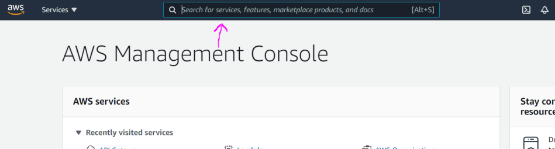

# CloudWatch

CloudWatch service is good for checking things. For example debugging.

# Basic Usage

1. In the AWS managment console search for **CloudWatch** service or pick from the Services dropdown menu.

2. Here is the initial screen of the service.

3. Here we will check an example with console.log coming from a lambda function. Click **Log groups** under **Logs**. Click the lambda function execution details. Note that for this example we have lambda function console.logging some text and we have executed it already to have some logs which we can check.

4. You will see stream of logs, if you have multiple select the latest. On the below screenshot you can see after the INFO, the text our lambda function is console.logging everytime the function is executed.

