# Cognito

Cognito service is a way to work with users and credentials

# Basic Usage

1. In the AWS managment console search for **Cognito** service or pick from the Services dropdown menu.
   

2. You have two main options:

- **Manage User Pools** - for working with users.
- **Manage Identity Pools**- for working for example with google, facebook.

# Manage User Pools

This pool will maanage users signed up in our application.

1. Select the option **Manage User Pools**, click the button **Create a user pool**. Now give it a name and select **Step through settings**.
   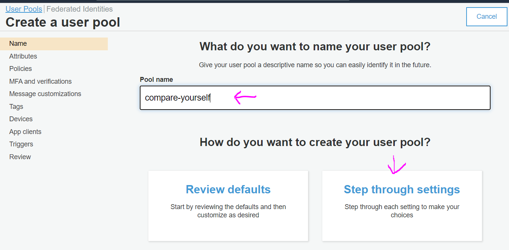

2. Proceed with selection as on the screenshots.
   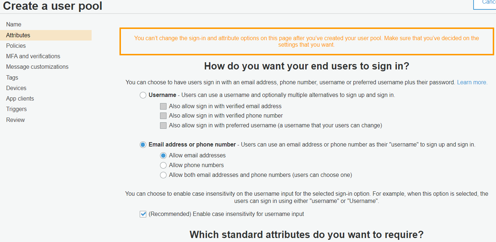
   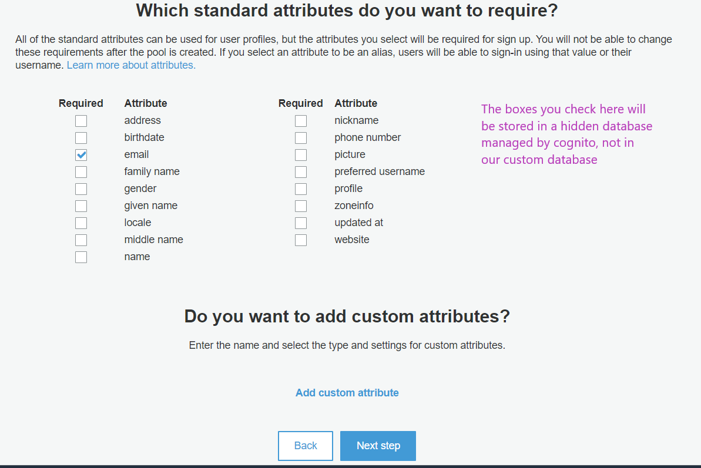
   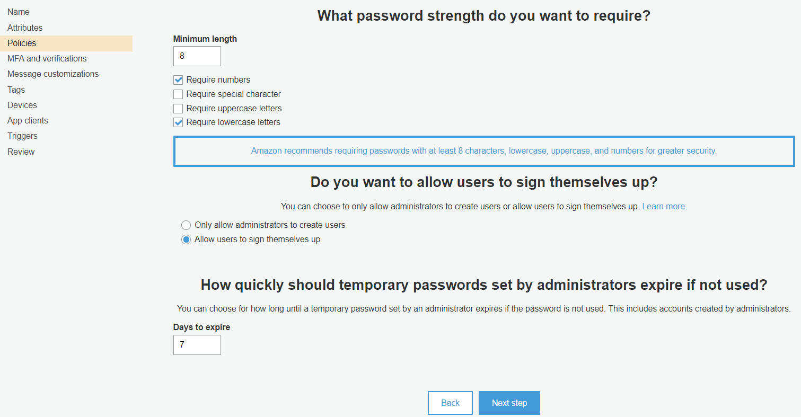
   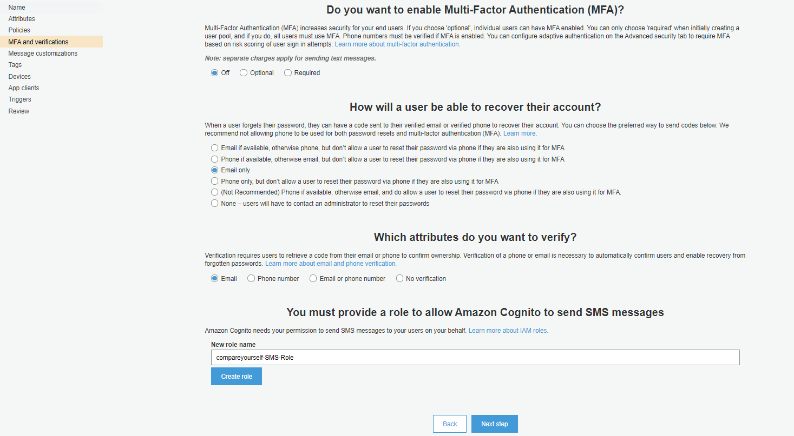
   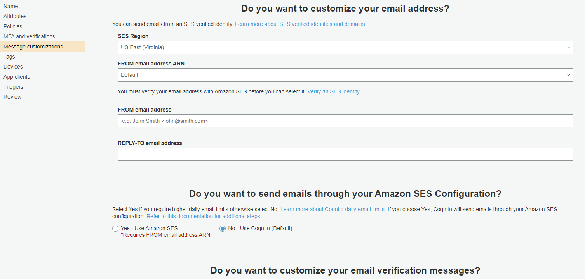
   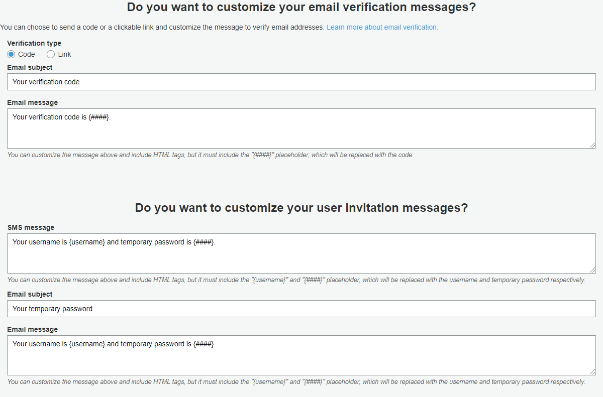
   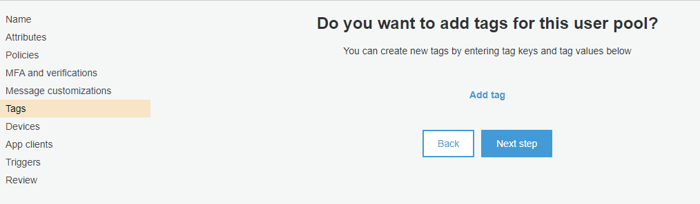
   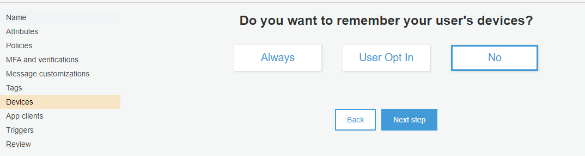

- On the next step click **Add an app client**. Important here is to uncheck **Generate client secret**.
  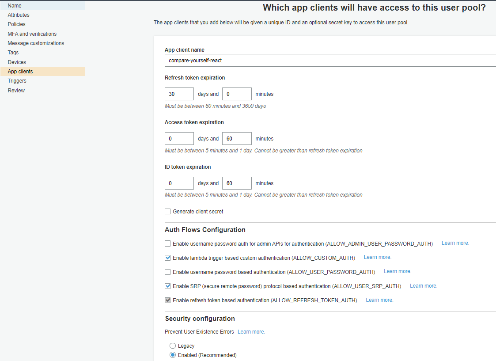
  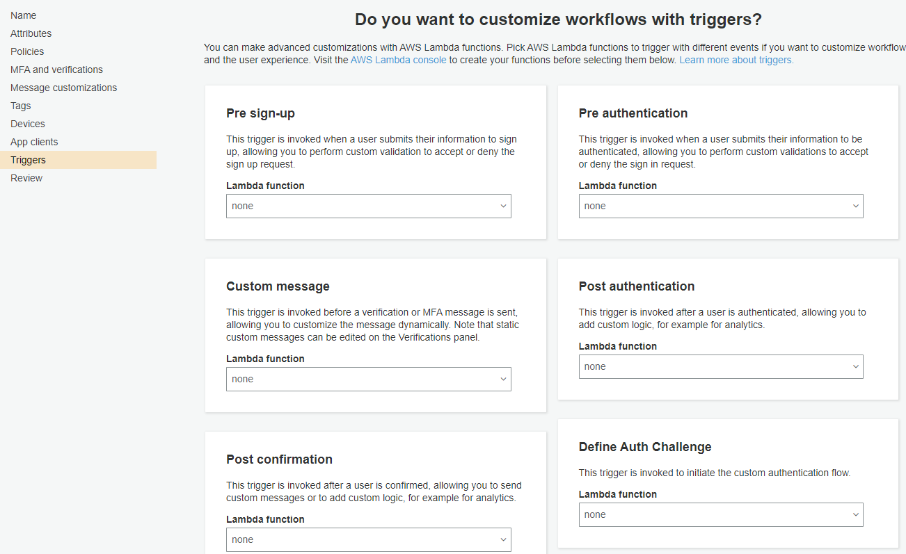
  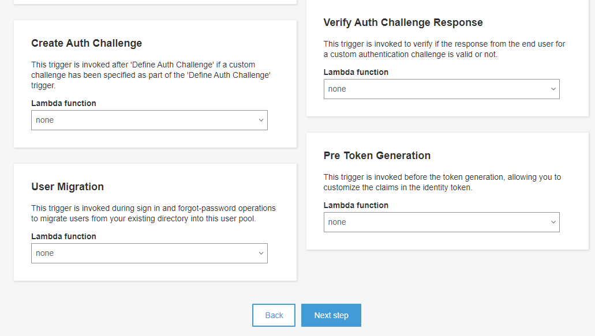

3. Click **Create Pool** after reviewing the selected settings.

4. Set domain name for your app:
   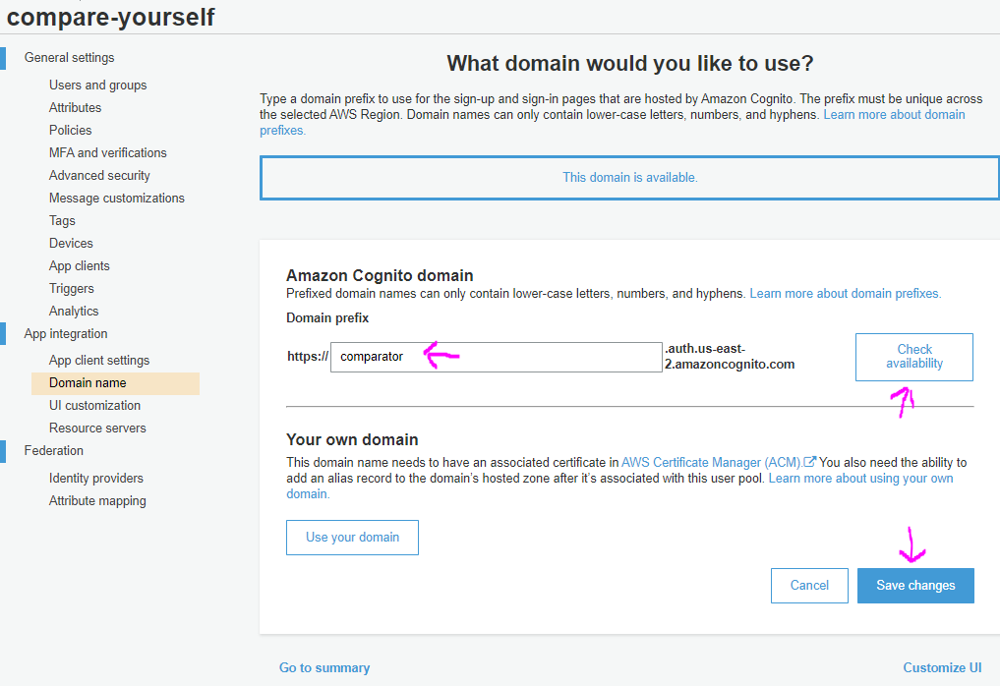

5. Here is the workflow of what is actually happening
   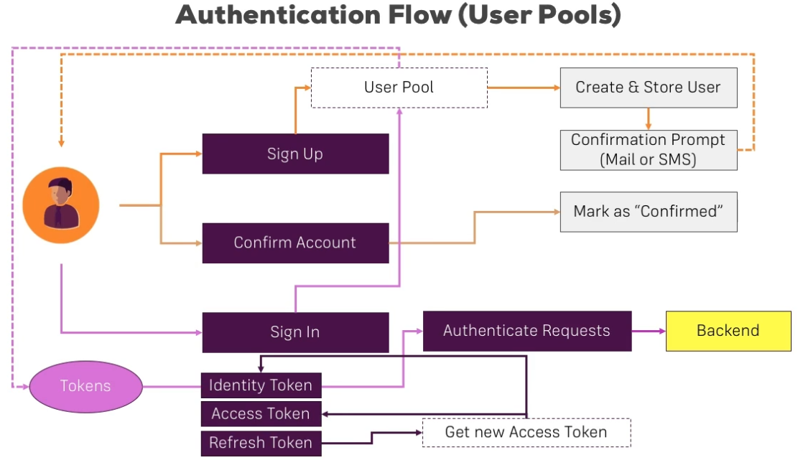

# Cognito with React

The react project is in the demo-project folder.

Clicking **Users and groups** you can see the list of users creating on the client.

While testing with random emails on signup, then we get error for unconfirmed email, we can manually confirm the mail in the pool window. Click **Users and groups**, then specific user and click the button **Confirm user**.
