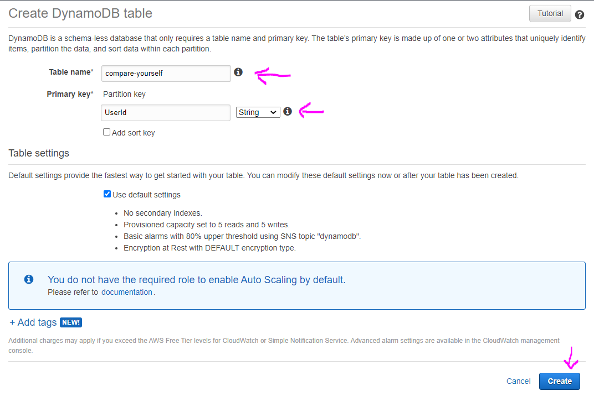
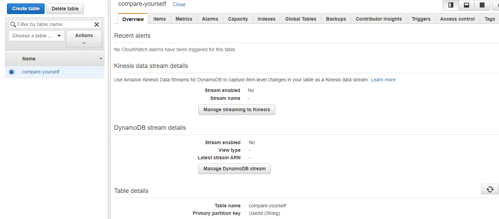
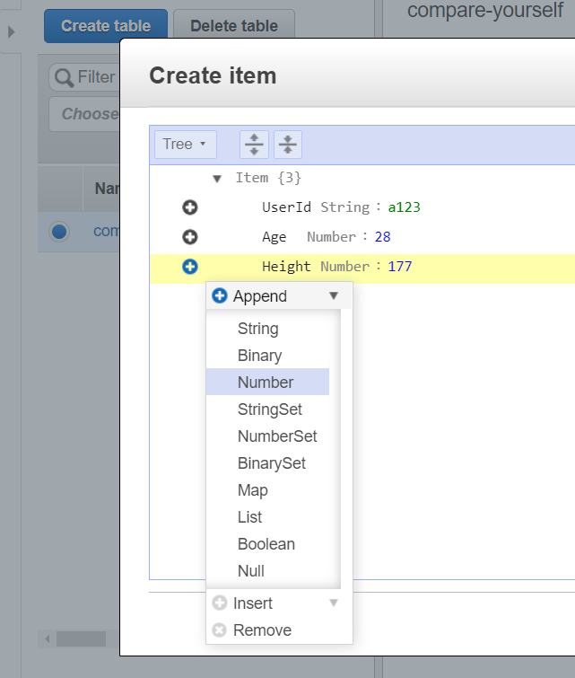
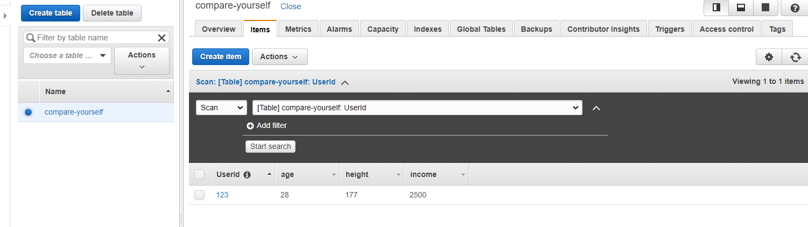
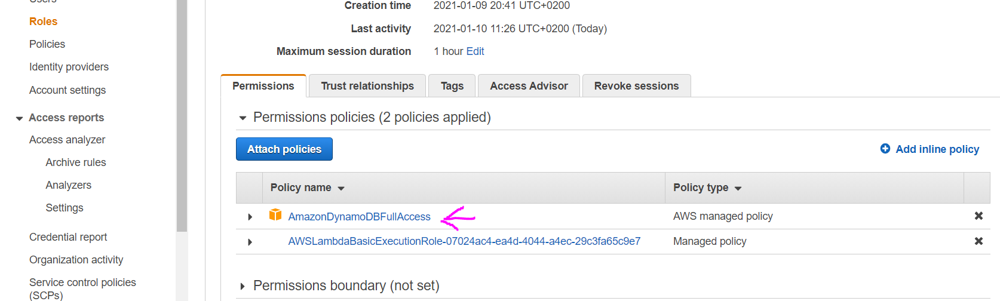

# DynamoDB

DynamoDB service is a NoSql database.

# Basic Usage

1. In the AWS managment console search for **DynamoDB** service or pick from the Services dropdown menu.
   

2. Give a **Table name** and **Partition key** and click **Create** button.
   

3. You will get to this details view after the table is created:
   

4. Now to create new item (row in the db) click the **Items** tab, then **Create item** button. In this example we will give dummy UserId manually and to add more columns click the plus sign, then **Append** and select the type of value you want to add and click the **Save** button.
   

5. Now we can see the data in our table:
   

6. Now after we have database we can access it in lambda function. For more info on aws-sdk check in common folder.

7. This is how our lambda function should look like:

```javascript
const AWS = require('aws-sdk');
const dynamodb = new AWS.DynamoDB({
  region: 'us-east-2',
  apiVersion: '2012-08-10',
});

exports.handler = (event, context, callback) => {
  const params = {
    Item: {
      UserId: {
        S: '1234a', // S stands for string
      },
      Age: {
        N: '29', // N stands for string
      },
      Height: {
        N: '181', // numbers we also send as string
      },
      Income: {
        N: '2300',
      },
    },
    TableName: 'compare-yourself',
  };
  dynamodb.putItem(params, function (err, data) {
    if (err) {
      console.log(err);
      callback(err);
    } else {
      console.log(data);
      callback(null, data);
    }
  });
};
```

8. But this setup still will not work, because by default lambda function has no rights to store data, for its role it has only logging rights. To add this kind of rights we will need IAM service.

9. Go to AWS managment console and search for IAM service. Click **Roles**, click the role name which our lambda function is using, click **Attach policies** search for dynamo and check the box for **AmazonDynamoDBFullAccess** and click **Attach policy**. Now you should see this policy also added for this role.
   

10. Now if you run **Test** on the lambda function to execute it, you should see the data in DynamoDB.

11. And if you followed the APIGateway Integration Request setup, you can get dynamic values like this, not just hardcoded ones.

```javascript
// this is what we have for the Mapping template in the Integration Response for our APIGateway service
#set($inputRoot = $input.path('$'))
{
  "age" : "$inputRoot.age",
  "height" : "$inputRoot.height",
  "income" : "$inputRoot.income"
}
// note that values are double quotes to have them as strings, because for DynamoDB we always pass values as strings
// Dynamo is handling the conversion to numbers
```

```javascript
const AWS = require('aws-sdk');
const dynamodb = new AWS.DynamoDB({
  region: 'us-east-2',
  apiVersion: '2012-08-10',
});

exports.handler = (event, context, callback) => {
  const params = {
    Item: {
      UserId: {
        S: 'user_' + Math.random(),
      },
      Age: {
        N: event.age,
      },
      Height: {
        N: event.height,
      },
      Income: {
        N: event.income,
      },
    },
    TableName: 'compare-yourself',
  };
  dynamodb.putItem(params, function (err, data) {
    if (err) {
      console.log(err);
      callback(err);
    } else {
      console.log(data);
      callback(null, data);
    }
  });
};
```
