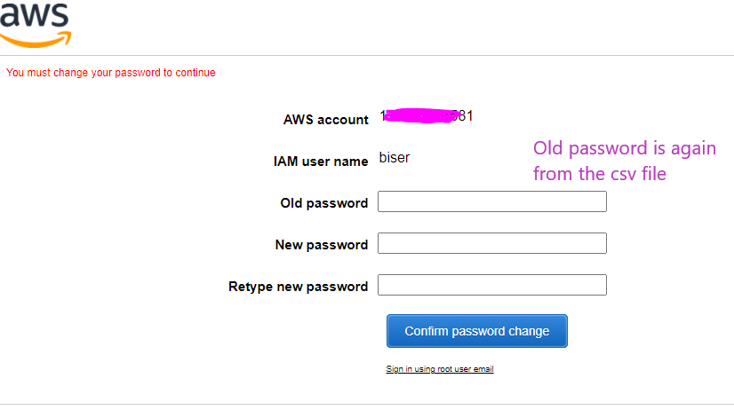
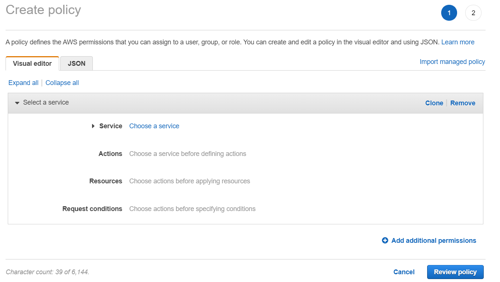
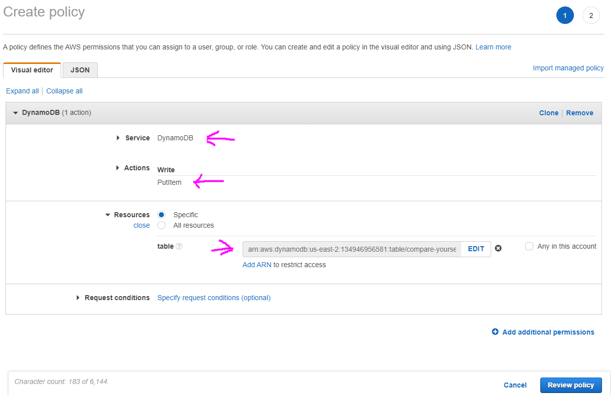
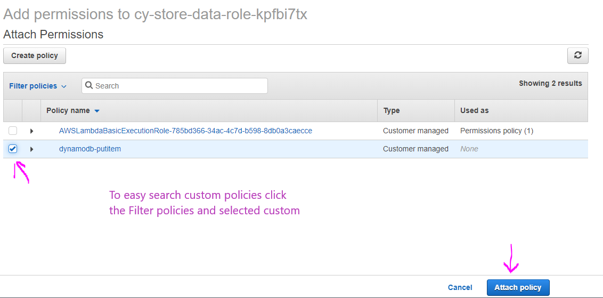

# IAM - Identity and Access Managment

Main points in IAM are:

- Users - usually physical person
- Groups - admins, devops etc.
- Roles - internal usage with AWS resources. Also collection of policies, for example ("SNS:CreateTopic", "SNS:Subscribe")
- Policies - they define what each of the 3 above can do. Can be _Allow_ or _Deny_. An example policy below. _Sid_ stands for statement id.

```
{
   "Version": "2012-10-17",
   "Statement": [
      {
         "Sid": "FullAccess",
         "Effect": "Allow",
         "Action": ["s3:*"],
         "Resource": ["*"]
      },
   ]
}
```

---

Note: It is not good practice to use your root account, best practice is to create IAM User. Root account is recommended to use only to create your account.

---

Here are some good and important notes:

- One IAM user per physical person
- One IAM role per application
- IAM credentials should never be shared (code, commits etc.)
- Root account is only for initial setup
- Never use root IAM credentials.
- Use MFA (multi factor authentication) fo every account.

# Basic Usage

In the AWS managment console search for **IAM** service or pick from the Services dropdown menu.


# Creating a user and a group

1. Click **Users** from the menu on the left, then **Add User**.
   

2. Fill the following information. The 4th step is just to review the selection from the previous steps. Download the csv file on the 5th step.
   
   
   
   

3. Now you can see your new user in the **Users** section.
4. Next step is to create a group. Click **Groups** from the menu on the left, then **Create new group** button.
   

5. Give it a name. Attach policies you need. Third step is to review the selection so just click **Create New Group**.
   
   

6. Now you can find your groups in the **Groups** section. Click it to add users in the group. From the **Users** tab click **Add Users to Group**, check all the users you want to add and click **Add Users**
   
   

7. Now after we have added our user to our admin group the user will inherit all of the admin group permissions. So we can go back to user's permission and remove **Administrator access** because he will inherit it from the group and if we in future remove the user from the admin group he will automatically lose the admin rights.
   

**Attached directly** policies are also hard to manage, because they go with the specific user, not on a group level.

8. Something also good to do is to update password policy for all IAM users. Click **Account settings** from the menu on the left, then click **Change password policy**.
   

9. Set the requirements for the policy which each user must follow, when setting up a password. And click **Save changes**.
   

10. And because we don't want to use the root account we will also use alias
    
    
    

11. Now we can use that new alias URL to log in with it.
    

12. Reset your password now, because this is requirement for our IAM users.
    

13. And now you will be logged in with your new user.
    

14. That's it, now you have admin user which you can use instead of your root user account, also alias replacing the account as a number.

15. One more thing is to also set MFA for this new user. To do that click your username (top-right on the screen) and from the drop down select **My security credentials**. Then **Assign MFA device**, then **Virtual MFA device**. Scan the QR code and finish the process.

# Creating a policy and attaching it on a role

If we are working with DynamoDB it is not good practice to use the full access policy, we should use custom and more specific serving only the purpose it needs, not unlimited rights.

1. To create a policy go to IAM service and click **Policies** and click **Create policy**
   

2. Select the **Service**, then select which actions you want to use for this role (PutItem in this example), select all you need and click the **close** link. Also provide the ARN(Amazon Resource Name) code for the resource you want to use (table in this example, because we are creating policy for a DB). You can see the DynamoDB table ARN in the Overview tab. Click **AddARN** link and paste the arn code.
   

3. After clicking **Review policy**, now give it a name and click **Create policy**.

4. Go to **Roles** from the menu on the left, select some role and from the **Attach policies** button you can attach our newly created policy. Search it and select it by checking the box on the left and click **Attach policy** buton.
   

5. Basically the cycle is to create policy for some service and some functionalities of that service and then to use that policy for some role which will be allowed to do only whatever is specified in the policy. Then we can use that role on some lambda function for example to limit the rights only to what we expect that function to do.
