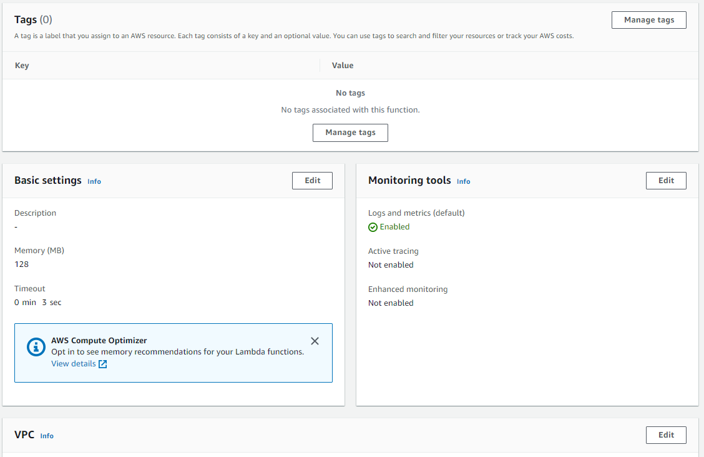
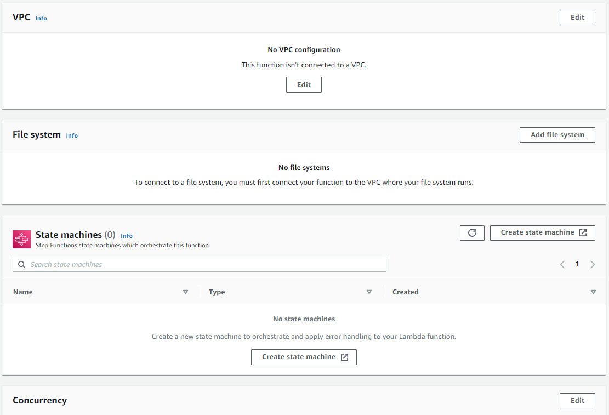
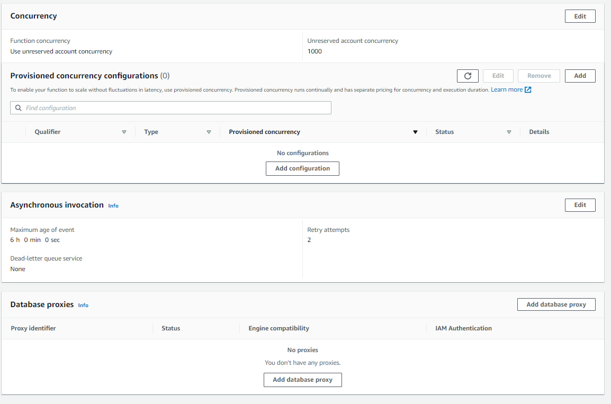

# API Lambda

The Lambda service provide us a way to run code on demand.

# Basic Usage

1. In the AWS managment console search for **Lambda** service or pick from the Services dropdown menu.

2. Click the **Create Function** button. The proceed with **Author from scracth**. Give a name on your function and click **Create function** button.

3. Once created we will see the details about our new function. Note that everytime we make changes on our function we need to redeploy it again, by clicking the **Deploy** button.

