# RDS

The RDS (Relational Database Service) service is for creating relational database.

# Basic Usage

1. In the AWS managment console search for **rds** service or pick from the Services dropdown menu.
   

# MySQL Database

1. Click **Create Database**. The proceed with **Standard create** and choose **MySQL**.
   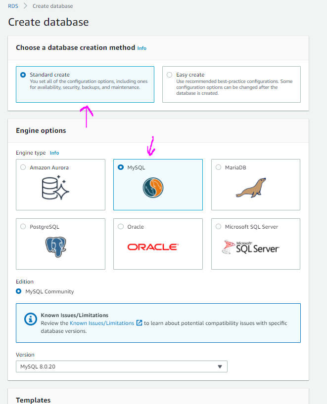
   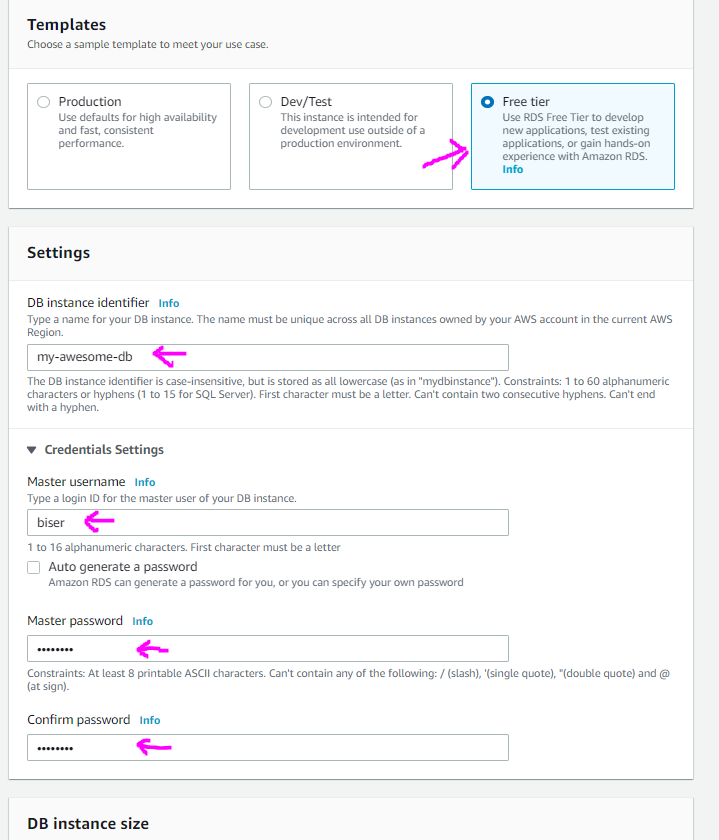
   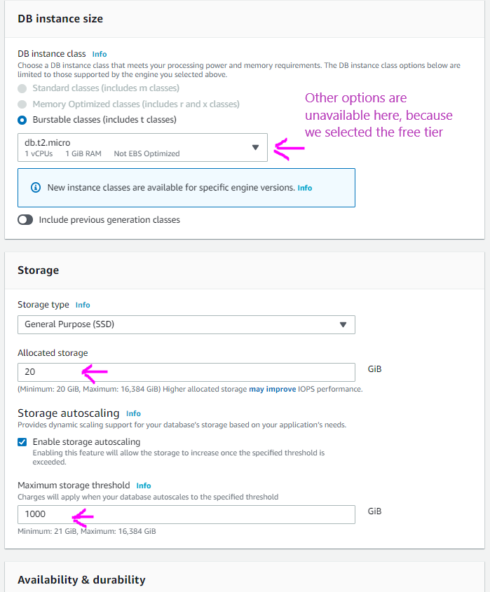
   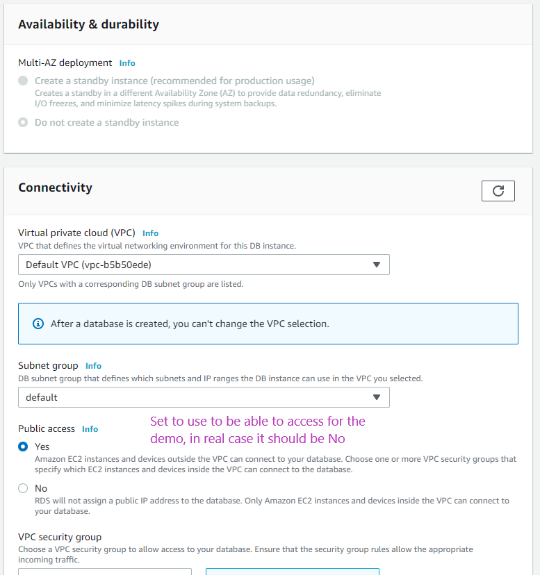
   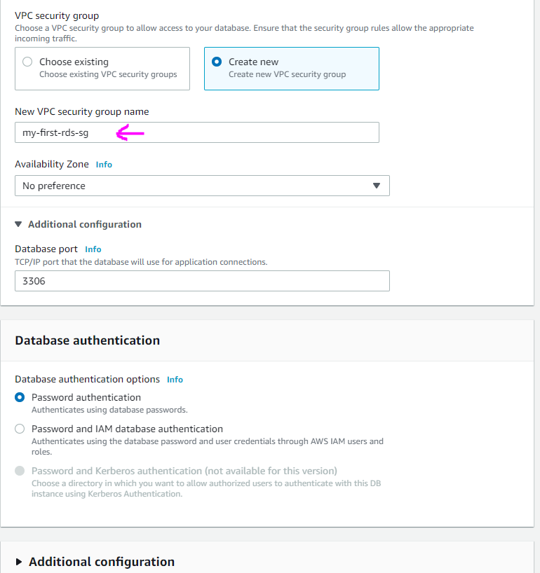
   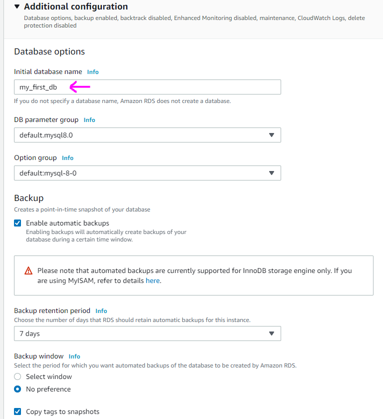
   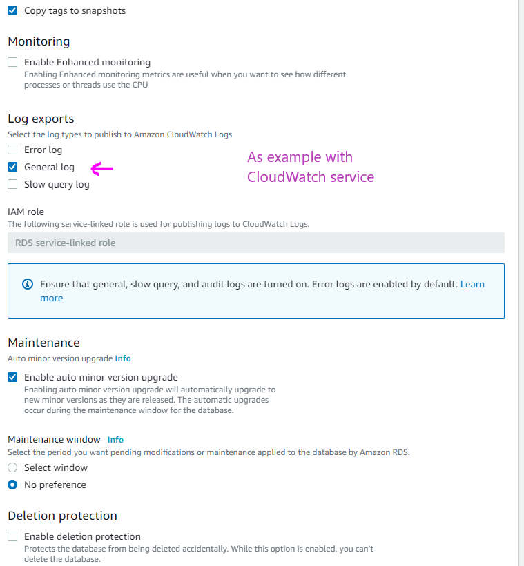
   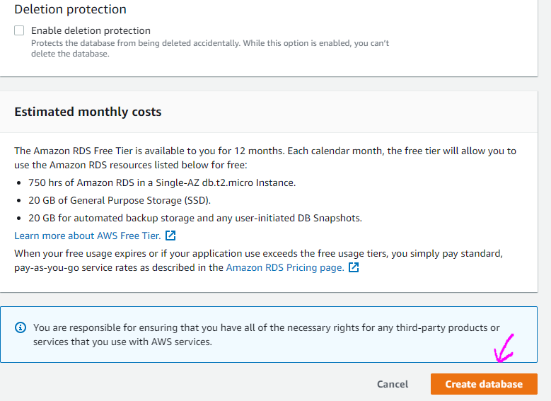

2. After few minutes your db will be ready.
   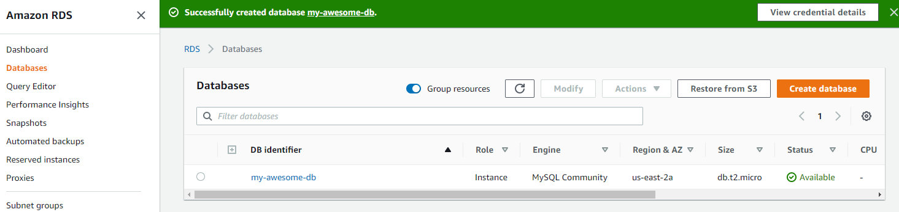

3. Open your database to get the configurations for it.
   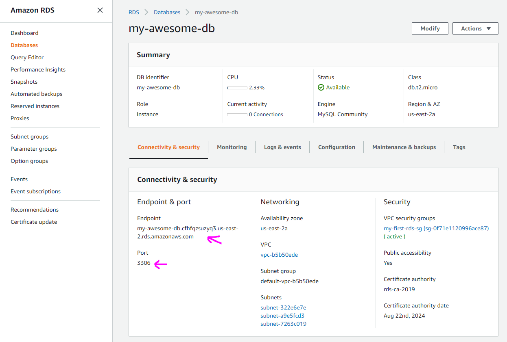

4. Test it with MySQL Workbench by making new connection and connecting to our new db.
   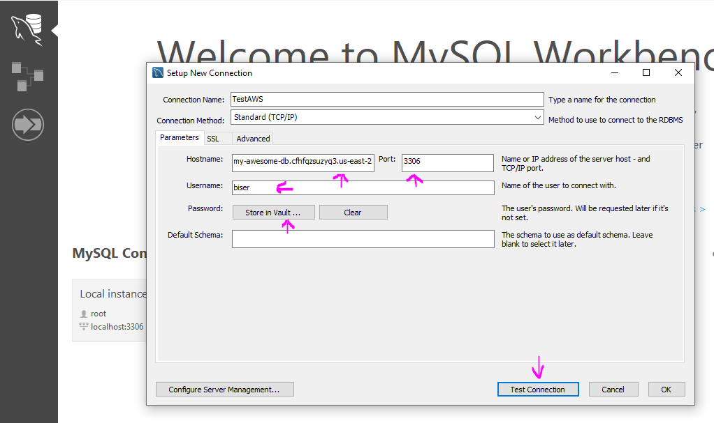

5. And now we can run some test queries to test our db:
   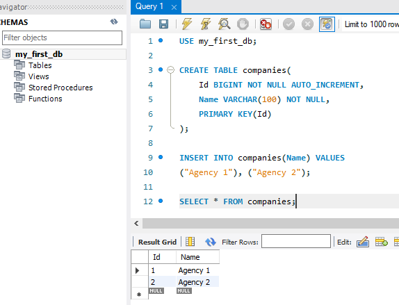
