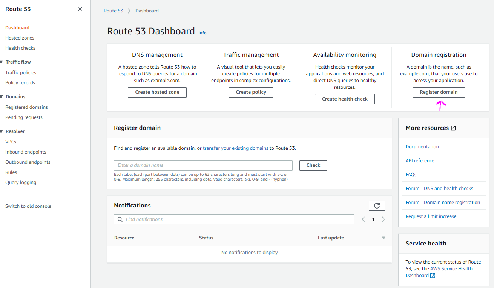
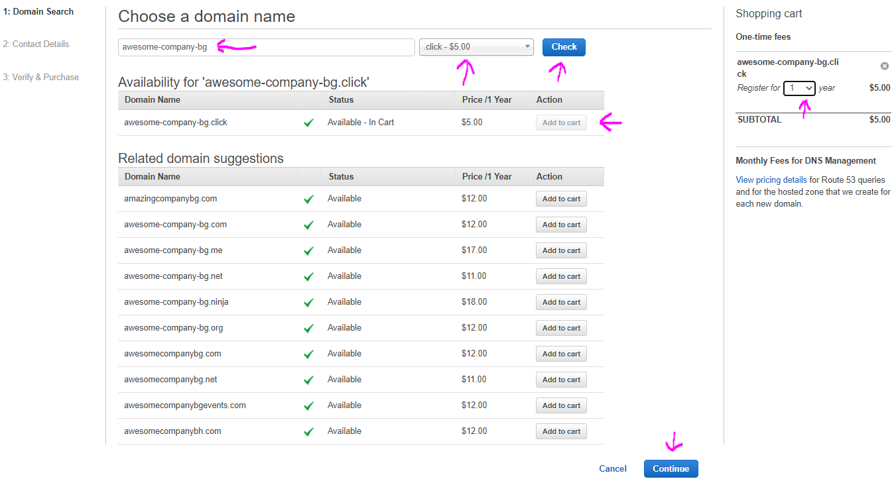
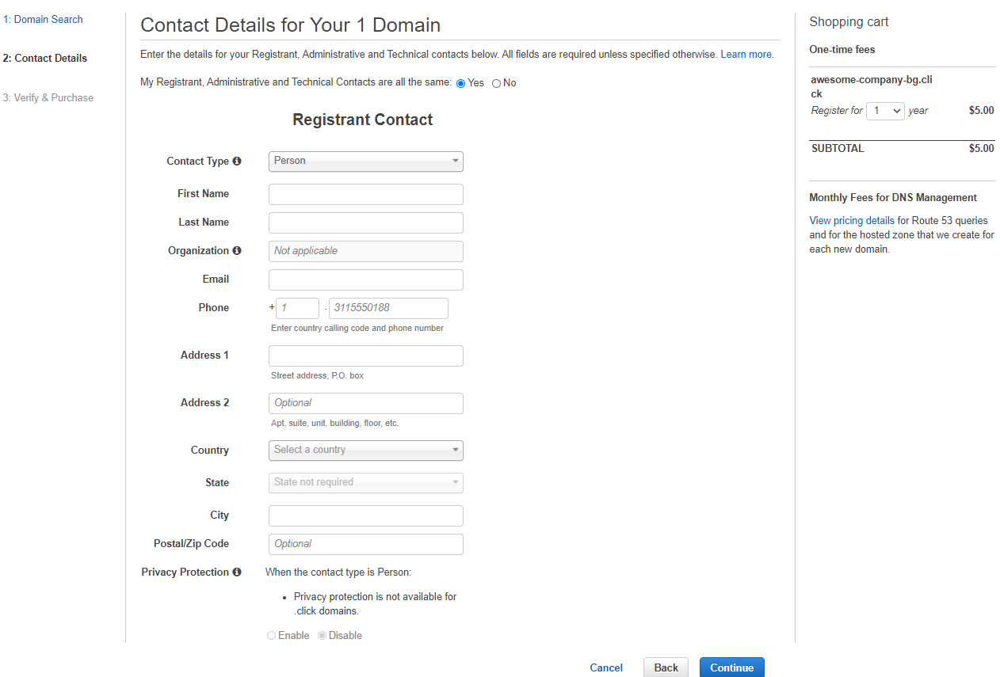

# Route53

Route53 is DNS (domain name service).

In AWS the most common records are:

- **A** - hostname to IPv4
- **AAAA** - hostname to IPv6
- **CNAME** - hostname to hostname
- **Alias** - hostname to AWS resource

# Basic Usage

In the AWS managment console search for **route53** service or pick from the Services dropdown menu.

# Register domain

1. Click the **Register domain** button.
   

2. On the next step provide the domain name you want to use and check if it is available. Click **Add to Cart** button once ready with all the selection and click **Continue**.
   

3. On the next page fill your payment details.
   

4. On the next step review your selection. Clikc the agreement box if everything is ok and click **Purchase button**. Once purchased your domain will be under **Domain** section **Registered domains**.
