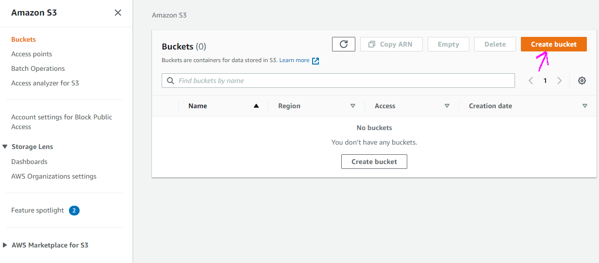
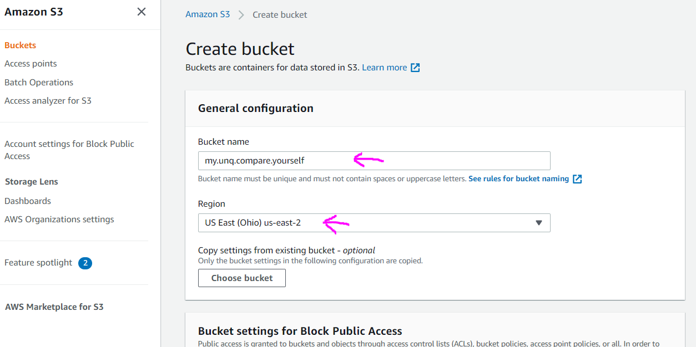
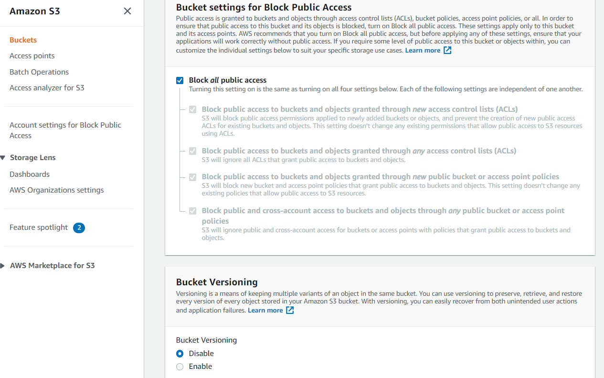
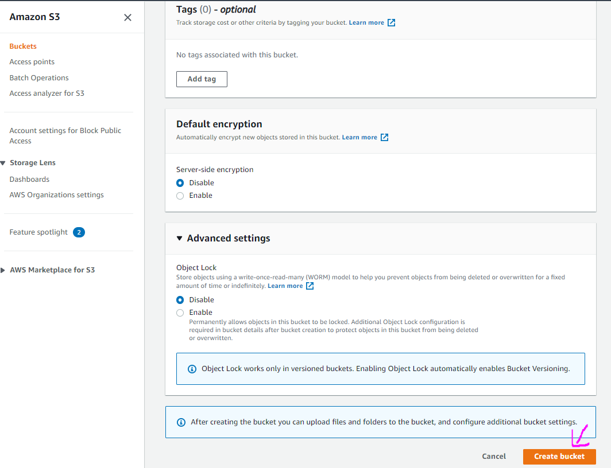
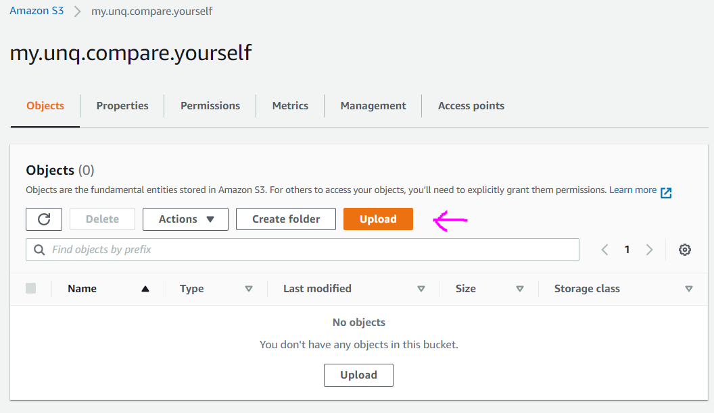
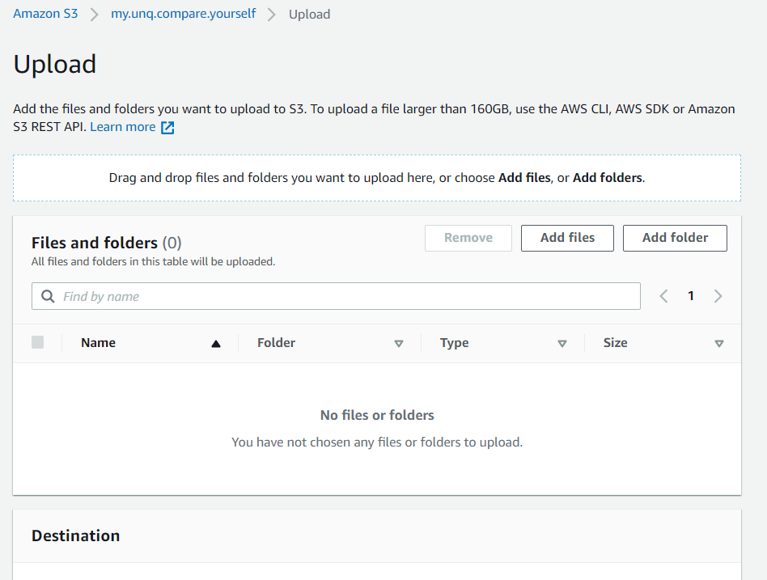
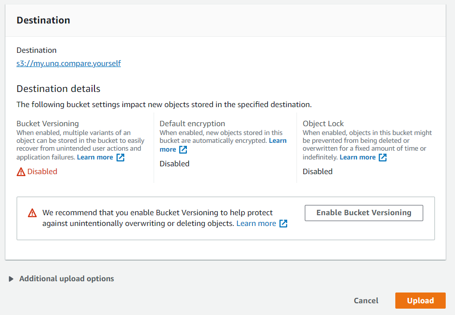
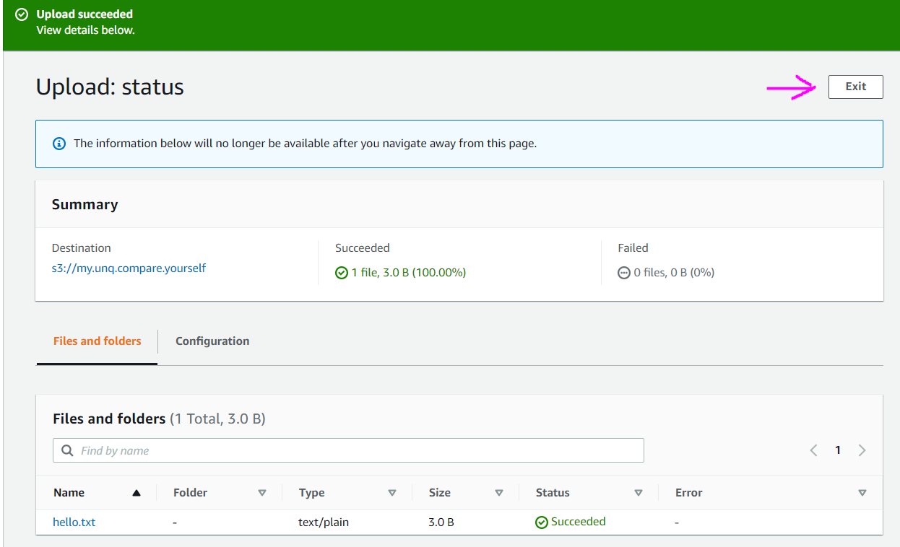

# S3

S3 (Simple Storage Service) allows us to store files. Files are organized in _buckets_.

# Basic Usage

1. In the AWS managment console search for **S3** service or pick from the Services dropdown menu.
   

2. Click **Create bucket** button to create one.
   

3. Giva a name for you bucket and select a region.
   
   
   

4. After selecting our newly created bucket we can start on uploading files. Click the **Upload** button to upload files.
   

5. Select the files you want to upload or you can also drag and drop them. Once selected you can preview them under the **Files and folders** section. Click **Upload** once you have all the files you want to upload.
   
   

6. Once uploaded you can review the upload and click **Exit** button.
   
