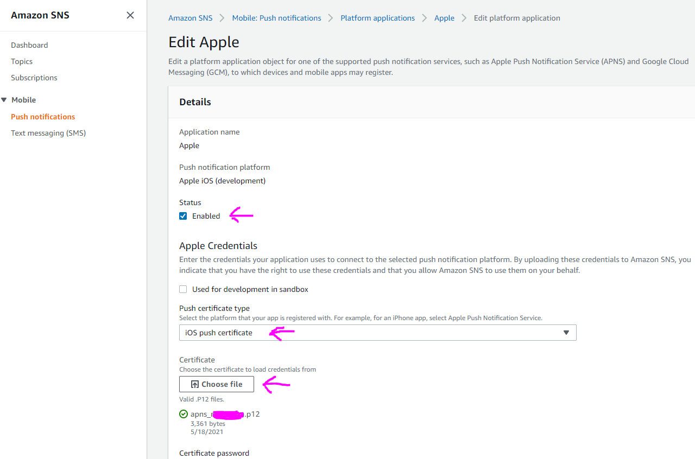
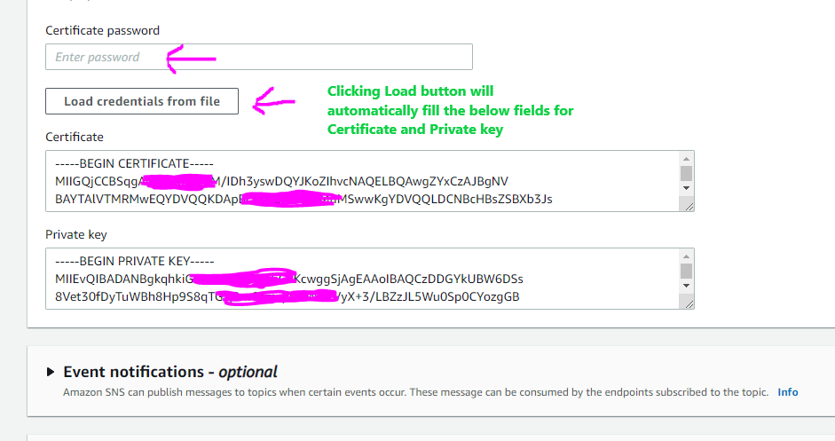

# SNS

SNS (Simple Notifications Service) allows us to work with notifications.

- S3 allows us to store objects (files) in _buckets_ (directories)
- _Buckets_ must have a globally unique name and they are defined at the region level. S3 basically S3 is a global service, but the buckets are placed in different regions.

# Uploading Apple certifcates

In the AWS managment console search for **SNS** service or pick from the Services dropdown menu.

1. Go to **Push Notifications** from the menu on the left.

2. Click **Edit** for you Apple application

3. Check **Enabled** for the **Status**

4. Select **iOS push certificate** from the dropdown.

5. Upload the **.p12** file. That file is generated by Apple.
   

6. Provide the **Certificate password**. You should have it also by the creator of the .p12 file.

7. Click **Load credentials from file** button to populate both fields below: **Certificate** and **Private key**.
   
